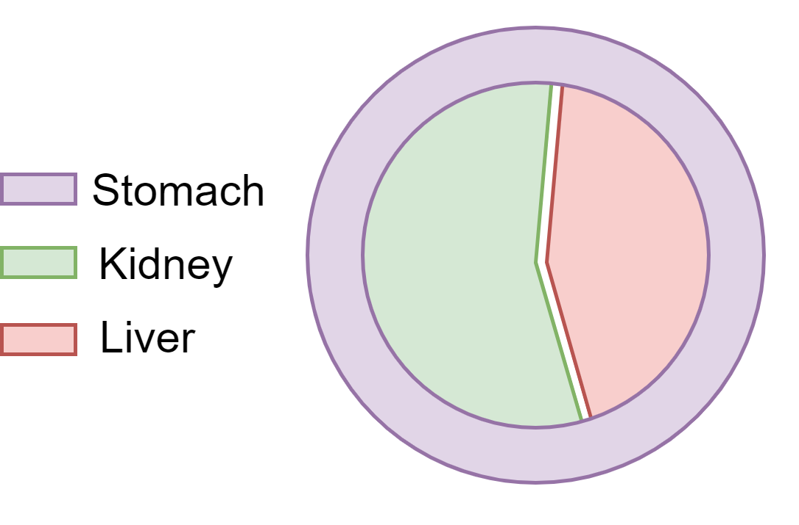
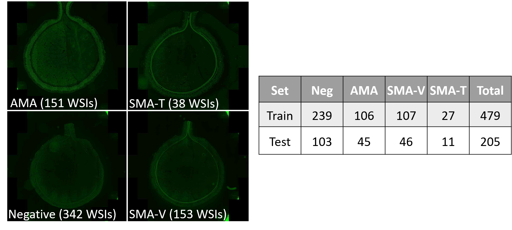

# Liver Kidney Stomach Dataset

This is the official repository for the Liver Kidney Stomach (LKS) whole slide image (WSI) dataset dataset introduced in the paper: [SOS: Selective Objective Switch for Rapid Immunofluorescence Whole Slide Image Classification](https://openaccess.thecvf.com/content_CVPR_2020/papers/Maksoud_SOS_Selective_Objective_Switch_for_Rapid_Immunofluorescence_Whole_Slide_Image_CVPR_2020_paper.pdf). The liver auto-antibody LKS screen is critical to the investigation of autoimmune liver disease. This is the first LKS WSI dataset to be made publicly available for research. 

# Dataset Creation

In collaboration with Sullivan Nicolaides Pathology, we constructed a novel LKS dataset from routine clinical samples. We used commercially available LKS slides comprising sections of rodent kidney, stomach and liver tissue. The multi-tissue section was prepared according to the schematic below: 



Patient serum was incubated on the multi-tissue section and treated with fluorescein isothiocyanate (FITC) IgG conjugate. The slides were digitized using a monocolor camera and a x20 objective lens with a numerical aperture of 0.8. A team of trained medical scientists manually labelled the slides into one of four classes: Negative (Neg); Anti-Mitochondrial Antibodies (AMA); Vessel-Type Anti-Smooth Muscle Antibodies (SMA-V) and Tubule-Type Anti-Smooth Muscle Antibodies (SMA-T). 


# Dataset Details

The distribution of the dataset and example WSI contents is given below:



# Download

The current version of the LKS dataset can be accessed [here](https://rdm.uq.edu.au/files/542dc8a0-7ed2-11ea-9b07-87e97005c7b7).  

The download comprises the 0.14 TB dataset compressed in 7z format. The uncompressed size of the dataset is 0.99 TB. This is considerably larger than dataset size quoted in the associated paper (300GB), as we made the decision to release the raw TIF images instead of the preprocessed image patches. This will allow researchers interested in using the dataset to study alternative preprocessing methods to those described in our paper.  

<div itemscope itemtype="http://schema.org/Dataset">
  <table>
    <tr>
      <th>property</th>
      <th>value</th>
    </tr>
    <tr>
      <td>name</td>
      <td><code itemprop="name">Liver Kidney Stomach Dataset</code></td>
    </tr>
      <tr>
      <td>description</td>
      <td><code itemprop="description">The Liver Kidney Stomach (LKS) dataset introduced in the CVPR2020 paper: "SOS: Selective Objective Switch for Rapid Immunofluorescence Whole Slide Image Classification". Includes 684 Immunofluorescence Whole Slide LKS Images used in the clinical investigation of autoimmune liver disease. </code></td>
    </tr>
       <tr>
      <td>distribution.contentUrl</td>
      <td><code itemprop="distribution.contentUrl">https://rdm.uq.edu.au/files/542dc8a0-7ed2-11ea-9b07-87e97005c7b7</code></td>
    </tr>
    </tr>
      <tr>
       <tr>
      <td>citation</td>
      <td><code itemprop="citation">Maksoud, Sam, Kun Zhao, Peter Hobson, Anthony Jennings, and Brian C. Lovell. "SOS: Selective Objective Switch for Rapid Immunofluorescence Whole Slide Image Classification." In Proceedings of the IEEE/CVF Conference on Computer Vision and Pattern Recognition, pp. 3862-3871. 2020.</code></td>
    </tr>
    </tr>
      <tr>
      <td>license</td>
      <td><code itemprop="license">https://creativecommons.org/licenses/by/4.0/</code></td>
    </tr>
    </tr>
      <tr>
      <td>sameAs</td>
      <td><code itemprop="sameAs">https://github.com/cradleai/LKS-Dataset</code></td>
    </tr>
  </table>
</div>

# Citation
Please cite the following paper when using this data for your research:

```latex
@inproceedings{maksoud2020sos,
  title={SOS: Selective Objective Switch for Rapid Immunofluorescence Whole Slide Image Classification},
  author={Maksoud, Sam and Zhao, Kun and Hobson, Peter and Jennings, Anthony and Lovell, Brian C},
  booktitle={Proceedings of the IEEE/CVF Conference on Computer Vision and Pattern Recognition},
  pages={3862--3871},
  year={2020}
}
```
